<a href="https://github.com/0xdeger">
  <picture>
    <source media="(prefers-color-scheme: dark)" srcset="./dark.svg">
    <source media="(prefers-color-scheme: light)" srcset="./light.svg">
    
  </picture>
</a>
